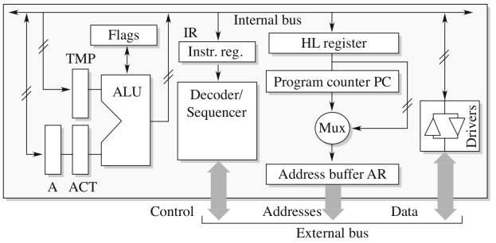
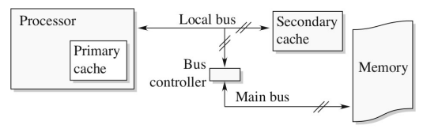
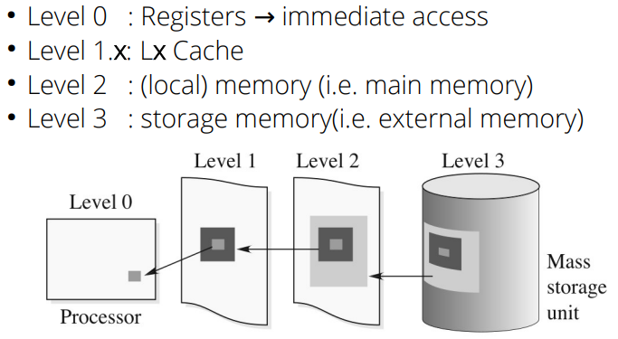

# Some notes

Whenever a course note is inserted it means that it is copied 1:1 from the worksheet without fact/logic checking etc. I intend to replace all these parts with human-speak.

## TODO

- Something about soft/hard interrupts
- Some more stuff about virtual memory
- Explain segmentation vs paging
- Multi-threading, multi-processing and multi-tasking
- Instruction fetching, decoding, executing etc
- IO, DMA, blocking, buffering
- IPC (pipes, signals, semaphores, sockets, etc)

## Things you need to know but aren't included in these notes

- Binary/hex counting, arithmetic (incl carry flags), conversion
- Fixed and floating point numbers
- Von Neumann architecture
- Arrays, queues and stacks (data structures)
- What is an operating system and kernel
- User mode and kernel mode
- Software compilation (e.g. high level languages and native languages)
- System calls
- File systems

## Bus Interconnection

Keep in mind that (unless noted otherwise) all answers are in **B**ytes per second (big B) and not **b**its per seconds (small b).

### What is the throughput of a 32 address/data bus at 100MHz?

We only look at the throughput of the data bus, because the address bus is not used for the actual data transfer (only used to know where to read the data from).

```python
freq = 100 * 1000 * 1000 # 100 MHz to Hz
size = 32 / 8 # 32 bits to bytes

# Devide by 1_000_000 to convert from bps to MBps
freq * size = 400 # MBps
```

### At what frequency does a 64 bit bus need to run to achieve a throughput of 12.4 GBps?

```python
tp = 12.4 * 1000 * 1000 * 1000 # 12.4 GBps throughput

# Divide twice by 1000 (base -> kilo -> mega)
tp / 8 / 1000 / 1000 = 1550 # 1500 MHz
```

### What is the throughput of a 32 bit databus and a 64 bit address bus operating at 133 MHz?

```python
bus_size = min(32, 64) # See notes
bits = bus_size / 8 # 32 bits to bytes
freq = 133 * 1000 * 1000 # 133 MHz to Hz

bits * freq / 1000 / 1000 = 532 # MBps
```

**Course note**

Comment ‘real throughput’: it orients itself on the lowest-width bus line (i.e. data or address). If both widths are the same, then this is no problem. If the data bus is smaller, we can transmit less information at each clock – even if the address bus is very large. If the address bus was smaller (e.g. we operate with 64-bit addresses while the address bus is only 32-bit wide), we need 2 bus clocks to transmit 1 address, so we only can transmit 1 data item over the data bus back to the requesting component for every 2 clocks of the bus (→ we need a whole 64-bit address to retrieve the data). Thus, in that case, the bandwidth is limited by the address bus width, not the data bus width. This definition does go against manufacturer claims, which are basing their bandwidth numbers on the data bus exclusively (to advertise greater speeds). They omit the fact that their device/components would not receive addresses at the same speed, which ‘starves’ the bus transmission. This can obviously also go vice-versa: the address bus is very wide, the data bus is smaller, hence data transmission is crippled by the data bus, but business people are advertising transmission speed with the address bus.

## Memory - Types

RAM = random access memory (aka not required to access sequential)

Cache is SRAM (static ram). This means that it uses flipflops which are faster than the alternatives, but also more expensive.

Main memory ('normal' RAM) is DRAM. This means that it uses capacitors to store data, which is cheaper but also slower. Additionally you need to continuously refresh your DRAM, because the capacitors would otherwise lose their charge/data.

All RAM in computers is volatile, which means that they lose their data when not powered.

There's also read-only memory (ROM), which does not lose it's data when powered off. (You don't need to know more than this, probably.)
Your BIOS code is stored in ROM (or EPROM but you don't need to know that).

## Memory – Segmentation

### Which segments do we have?

- Code (instruction segment)
- Data segment
- Stack segment

### Why do we segment the memory?

When multi threading all threads share the same code and data stack. Each thread has its own stack segment.

**Course note**

data protection; allow multiple programs to run in an alternating fashion by sharing
instruction segments → one program runs at a time, so only one code segment needs to be
active.

### What is the total memory size addressable with a 30 bit virtual address?

```python
# Divide three times by 1000 (bytes -> kbytes -> mbytes -> gbytes)
2 ^ 30 / 1024 / 1024 / 1024 = 1 # GB
```

Note: it does not matter that this is a virtual address, the only important bit is the bit count.

### Inside a 30 bit virtual adres we have 13 MSBs which are the selector and 16 LSB which are the local address. What is the last bit used for?

The remaining bit is the table selector. With 1 bit we can select `2^1 = 2` different tables.

Selector = selects the individual segment to-be-loaded into memory
Local address = offset within the given segment

The 13 selector bits give access to `2^13 = 8192` segment table entries.

### The base address space (and this the physical address space) is 24 bits. How large is the physical memory?

```python
2^24 / 1024 / 1024 = 16 # MB
```

### The local address is 16 bits. How large is each memory segment?

```python
2^16 / 1024 = 64 # KB
```

Note: this assumes that each memory segment is indeed exactly as large as the local address allows it to be. I don't know if this is always the case.

### Why do we have 32 times more segment descriptor entries than we have unique segments entries.

13 bit selector = 8192 entries in the descriptor table.
(24 bit address - 16 bit local address) = 8 bit segment part = 256 entries

8192 / 256 = 32 times more segment descriptor entries.

**Course notes**

We have overlapping segments, for example: if the total code segment is 12 KB, then this can be filled by 6 different 2KB segments, or 3x 4KB segments, or 4x 3 KB segments. Each of those segments exist – they just don’t uniquely need to fit into a
whole segment block. Also, individual segments do not need to be exactly 64KB large – they are theoretically, but some segments can be smaller. This happens particularly for data segments. The only segment that is nearly-uniform is the stack segment, because
it’s maximum size needs to be defined by the program or the operating system. Because of these irregularities in segment sizes, the segment descriptor needs to store the segment size.
In terms of the two tables in the example, we can occupy each segment either with ‘data’ or with ‘code’ - therefore, there may be segment descriptor duplicates, where a segment descriptor is in the ‘data segment table’ and the ‘code segment table’. In this example from the book though, one table stores global information and one stores local information (information here equals variable).

## Memory - Paging

### What is the purpose of memory paging?

Allows your virtual memory to be larger than the physical memory size.

### What is a page table?

**Course note**

A page table maps the page number code (encoded in the page number segment of the virtual address) into an actual page number than can be referenced in the system. It hence provides the base for the page offset (local address section) of the virtual address

### What is a page table directory?

**Course note**
Page table directory: a list of all available pages in the system, together with their access rights (read/write), protection etc.

## CPU – Layout

### What's the purpose of the control unit

**Course note**

- control the instruction flow
- define CPU frequency / speed
- process interrupts
- decode instructions
- convert instruction byte codes into operation signals
- send operation / command signals to the execution components (e.g. ALU)
- access external bus
- request & retrieve memory information;

### What's the purpose of the process/compute unit?

**Course note**

- compute logical & arithmetic operations
- hold data in local registers
- provide data for calculation
- control special registers
- store & evaluate calculation events
- manage the stack pointer

### You probably need to know this image



### Beep boop

- 32-bit architecture
- 32-bit ALU's
- Running at 3154 MHz
- Memory clock of 166 MHz

#### What is the width of the address bus?

32 bit

#### What is the size of the address registers, and which registers are considered address registers?

32 bit. Instruction pointer and HL register.

#### What is the size of a full data register (e.g. Ax, Bx, ACT)?

32 bit

#### Each register is split into a high and low segment. What is the size of each segment?

16 bit

#### What is the minimum width of the (internal) data bus for this architecture?

16 bit, though I don't know why.

#### Can this architecture process double-precision floating-point instructions?

**Course note**

yes – then, 2 data registers (e.g. Ax and Bx) need to be logically fused. That means the low integer portion (e.g. Bx) is computed first with the 2nd operant’s low integer. The carry- and overflow bits are preserved and used as input for the high-integer operation (e.g. with Ax). It takes then multiple clock ticks to achieve it – but is possible.

#### Assuming the instruction register and decoder are both 16 bit wide, how many instructions can this provide?

```python
2 ^ 16 = 65536
```

Note: this conveniently leaves out instructions which use immediate values (e.g. `mov r0, #3`). I guess we won't have to know about this then.

#### Why do we need an address buffer? Re-consider the address width for techniques such as memory paging and segmentation.

The raw memory address (32 bit) still needs to be fused with the paging and segmentation bits to transmit the virtual address.

// TODO: Add example?

#### What is the purpose of the internal clock of the sequencer?

**Course note**

Provide the base frequency of the processing; it paces the instruction flow and the bus transmission; it provide a time step and – in combination with the frequency – a highprecision time;

#### How can the higher clocked CPU communicate with the lower clocked memory?

When the CPU requests something from the memory bus it will have to also add some wait cycles, while it waits for the memory bus to actually tick.
To align the clock frequencies the internal sequencer clock speed is integer matched to the frequency. In this case the multiplier is 19.

```python
cpu_clock_mhz = 3154
mem_clock_mhz = 166

cpu_clock_mhz / mem_clock_mhz = 19 # The multiplier
```

The course also states that it is a good idea to request all needed data from RAM at once, so that it can be loaded into the cache. Any latter access will then hit the cache, and this be faster.

#### Does the pre-described architecture have any influence on the size of the flag register ? What is the purpose of the flag register ?

**Course note**
Purpose: The flags stores control and signal information to interpret computation results and initiate interrupts. The size of the flag register is only influenced by the output signals of the adder / ALU / FPU, as well as the flags required for interrupts. Impact: The architecture does have an influence on the flag registers. The number of flags stored or (compound) arithmetic or logical operations can vary, depending on the processor. For evaluation purposes, it’s matched to the next full-byte bit width.

## Memory & Caching – Access Performance

### Cache layout



### Memory hierarchy



### Cache -> Memory Synchronization

#### Write through

Data is written simultaneously on cache and memory. This is rather slow because each write writes to both the cache and memory, and thus acts as if the cache wouldn't even be there. Memory reads only access the cache, and thus faster than when not using caching.

#### Write-back

Uses a dirty bit. When this element goes out of cache and the dirty bit is set, then it will be written back to the memory. If the dirty bit is not set then nothing happens (as the memory is still up-to-date).

#### Posted write

Update cycles controlled by memory controller, executed when memory bus is free.

### Beep boop

Lets assume the following:

- CPU clock = 1 GHz
- Mem clock = 100 MHz
- L1 cache access time = 1 tick

#### What is the access time of the L1 cache?

1 tick, so with a 1GHz CPU clock this would be 1 ns.

#### Given that memory access is split between 4 CPU ticks and 6 RAM ticks. What is the total time access time for 1 item from RAM?

64 nanoseconds, of which 4 are from the CPU and 60 from the memory.

```python
cpu_tick_time = 1_000_000_000 / 1_000_000_000 # 1e9 ns divided by 1 GHz aka 1e9 Hz
mem_tick_time = 1_000_000_000 / 100_000_000 # 1e9 ns divided by 100 MHz aka 1e8 Hz
cpu_time = 4 * cpu_tick_time # 4 ticks of 1 ns (1 GHz) = 4 ns
mem_time = 6 * mem_tick_time # 10 ticks of 10 ns (100 MHz) = 100 ns

cpu_time + mem_time = 64 # ns total time
```

### What is the mean acces time and cache speed-up when we have a hit ratio of 0.9?

Mean access time = 7.3 ns
Speedup = 8.767 ns

```python
# Mean access time
# 10% memory access which takes 64 ns
# 90% cache access which takes 1 ns
tm = 64 * 0.1 + 1 * 0.9
# tm = 7.3 ns

# Cache speed-up
speedup = 64 / tm
# speedup = 8.767 ns
```

### Lets introduce the L2 cache

Given the following:

- L1 cache hit ratio = 0.25
- L2 cache access time = 2 ticks
- L2 cache speed = 50% CPU clock = 500 MHz
- L2 cache hit ratio = 0.4

#### What is the access time to the L2 cache?

Mean access time for the L2 cache = xxx

// TODO: This seems wrong, fact check the course notes!

**Course note**

T(L2 cache) = 1T (send L1→ L2) + 1T (look-up) + 1T (L1 receives update from L2)
= 3T = 3 \* 10-9 sec = 3 ns
